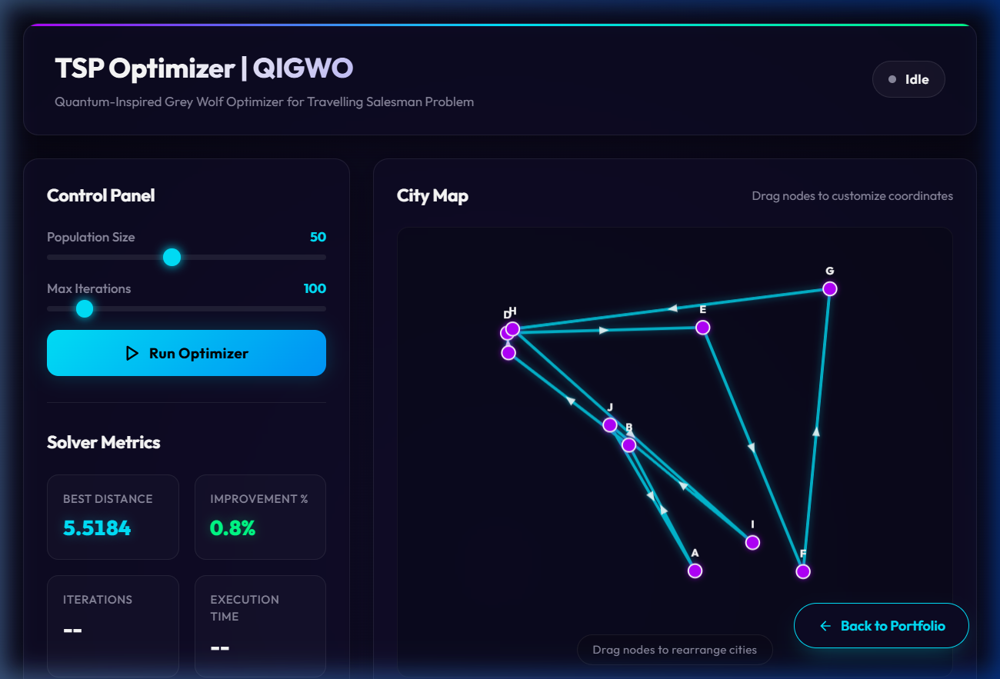
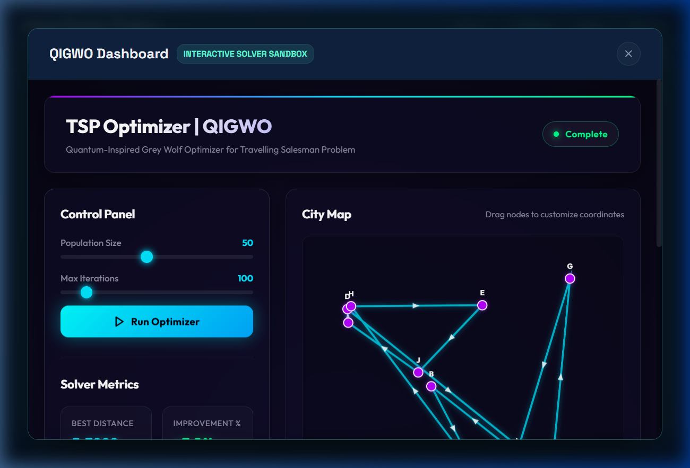

# TSP Cost Optimization using QIGWO 

An interactive, responsive single-page portfolio website showcasing a highly optimized metaheuristic engine for the **Travelling Salesperson Problem (TSP)** using a hybrid **Queen-Influence Genetic Algorithm (QIGA)** and **Grey Wolf Optimization (GWO)**.

## Project Structure

- **`index.html`**: The main portfolio website of **Utsav Kumar Thakur**. It showcases the project and hosts an integrated, full-screen live demo modal.
- **`dashboard.html`**: The standalone solver dashboard containing the complete QIGWO simulation environment, interactive controls, and Chart.js analytics.
- **`/dashboard`**: Directory routing copy of the dashboard (`dashboard/index.html`) allowing clean URL navigation.
- **`assets/`**: Project screenshots and visuals.

---

## Technical Features

- **QIGWO Hybrid Solver**: Employs Grey Wolf hierarchy dynamics combined with Genetic crossover and mutation operators to resolve combinatorial pathing.
- **Dynamic Convergence Visualizer**: Features real-time Chart.js tracking of the objective value (cost/distance reduction) across iterations.
- **Adaptive Parameter Control**: Slider elements adjusting population size and maximum iterations directly affect convergence speed.
- **Full Responsive Presentation**: Designed using pure modern HTML and custom CSS variables, optimized for mobile, tablet, and widescreen viewports.
- **Cross-Window Messaging (`postMessage`)**: A floating "Back to Portfolio" button inside the nested dashboard iframe alerts the parent page to close the fullscreen modal overlay seamlessly.

---

## Screenshots

### 1. Portfolio Landing Page
Features the header navigation, custom animated SVG node networks, details of the solver, and a 20% average cost reduction callout.


### 2. Standalone QIGWO Optimizer Dashboard
A dark-mode analytics console featuring canvas node paths, convergence line charts, and active parameter controls.


### 3. Solver Path Convergence
Visual representation of genetic-heuristic iteration runs converging on the globally optimized tour path.


---

## Local Setup

Since this project consists of plain, client-side static HTML/JS files, it can be served using any local web server.

### Option 1: Python HTTP Server (Recommended)
Run the following command in the root folder `d:\TSP`:
```bash
python -m http.server 8080
```
Then navigate to:
- Portfolio: `http://localhost:8080/index.html`
- Standalone Dashboard: `http://localhost:8080/dashboard/`

### Option 2: Live Server (VS Code Extension)
Right-click `index.html` and choose **Open with Live Server**.
